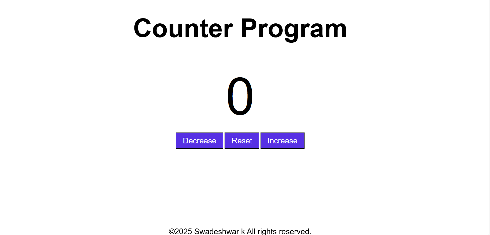

# Counter-Program

A simple, interactive counter web application built with HTML, CSS, and JavaScript. This project demonstrates DOM manipulation and event handling in JavaScript with a clean and responsive UI.

## 🖥️ Live Demo

You can open the `index.html` file in your browser to try it out locally.

## 📂 Project Structure
 ├── index.html # Main HTML structure 
 ├── style.css # Styling and layout 
 └── index.js # JavaScript logic for counter functionality
 
## 🚀 Features

- Increase, decrease, or reset the counter
- Smooth and responsive button interactions
- Real-time year display in the footer
- Modern styling and layout

## 📸 Preview

 

## 🛠️ Technologies Used

- HTML5
- CSS3
- JavaScript (ES6)

## 📌 Usage

1. Clone or download the repository
2. Open `index.html` in your web browser
3. Click the buttons to increase, decrease, or reset the counter

## 📄 License

&copy; [Swadeshwar k](https://github.com/yourusername) – All rights reserved.

---

